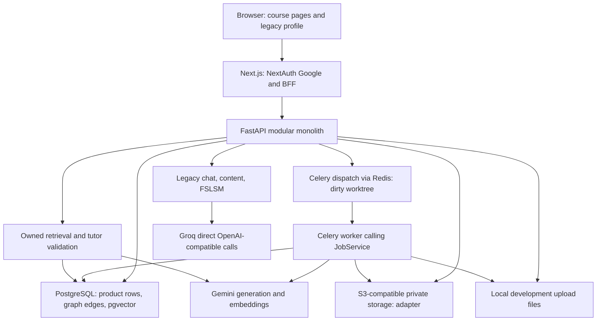
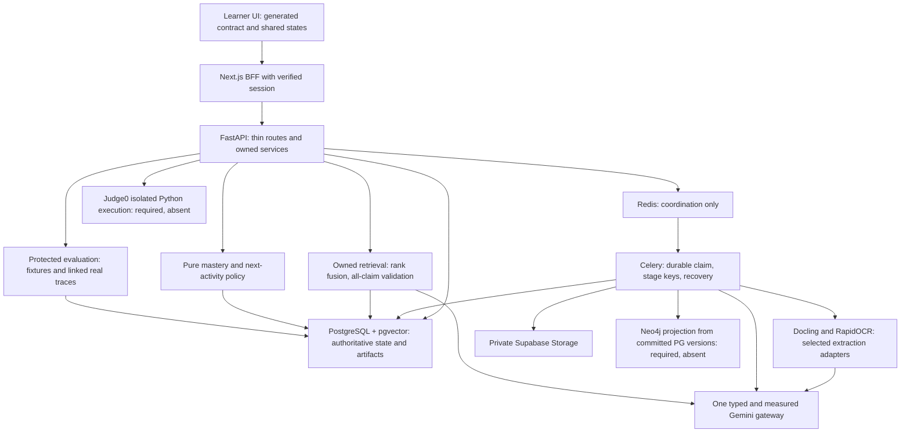

# NeuroLearn — principal engineer and ML review

Reviewed 5 October 2026. **READ-ONLY source review.** Only this report was created. No commit, merge, migration execution, user-data mutation, or AI-provider inference was performed.

Evidence baseline: branch `chore/baseline-stabilization`, HEAD `eedd2a4f0662f935f0da02a2417023fba680e951`, plus the pre-existing dirty working tree. There were **39 modified/deleted tracked paths and 16 untracked files** before this report. Working-tree citations below refer to that snapshot, not necessarily to committed HEAD. Git observations cite refs/commands; runtime observations cite the executed checks in §2. Recommendations are proposals, not implemented capabilities. **UNVERIFIED** means neither the claimed behavior nor its quality was demonstrated here.

## 1. Executive summary

1. This is a modular learning prototype, substantially beyond the old chat-only audit (`backend/app/main.py:130`, `backend/app/modules/curriculum/service.py:86`).
2. The central loop is unfinished: standard lesson assessments explicitly stop at an unavailable screen (`frontend/app/(pages)/courses/[courseId]/assessment/page.tsx:66`).
3. Tutor retrieval exists; complete semantic grounding does not: empty claims, sampled validation, and truthy string parsing undermine its guarantee (`backend/app/modules/tutor/service.py:126`, `backend/app/modules/tutor/validation.py:95`, `backend/app/modules/tutor/entailment.py:28`).
4. The old FSLSM/Groq product and the course/mastery/Gemini product coexist (`backend/app/main.py:134`, `backend/app/main.py:143`, `backend/app/modules/chat/router.py:135`).
5. Frozen behavior and actual grading/sequencing disagree (`backend/app/modules/mastery/grading.py:41`, `backend/app/modules/mastery/engine.py:127`, `backend/app/modules/adaptation/service.py:242`).
6. The Celery transition retains startup logic that can invalidate live worker jobs (`backend/app/main.py:74`, `backend/app/modules/jobs/dispatch.py:15`).
7. Backend tests: **602 passed, 3 failed, 1 skipped** after ephemeral test-dependency setup; frontend lint, types, three tests, production build and sign-in HTTP passed (§2).
8. `main` is 69 commits behind baseline; baseline includes 244 changed paths, plus uncommitted infrastructure/lifecycle changes (`git diff main...HEAD`; §3).
9. Prioritize trusted assessment, grounding, durable jobs and contract integration; model replacement and decorative UI work come later (§4–§8).
10. All ten question defaults were accepted in this chat. Exact deadline, budget amount, hardware specifications and “jev/laya” identities remain **UNVERIFIED** (§9).

## 2. Verified facts vs. claims in the old audit

“Implemented by inspection” below does not mean the deployed/live behavior was exercised. The audit itself is internally inconsistent: its diagram says no vector index while its edited item 7 says pgvector is built (`docs/neurolearn-implementation-status.md:47`, `:66`). Its historical observations should be dated, not silently updated one row at a time.

| Old claim | Current evidence and verdict |
|---|---|
| Chat/profile is the whole application; only four routers | Stale. Seventeen `include_router` calls cover old and new domains, including health. Course, curriculum, mastery, adaptation, tutor and evaluation are registered (`backend/app/main.py:130`). Import and health/OpenAPI startup were executed; each route's live behavior was not. |
| No course/document/concept/mastery/decision domains | Stale. Course/version, concepts, lessons, questions, mastery events and separate decisions/outcomes have ORM implementations (`backend/app/modules/courses/models.py:1`, `backend/app/modules/curriculum/models.py:168`, `backend/app/modules/mastery/models.py:48`, `backend/app/modules/adaptation/models.py:106`). |
| `create_all` shapes production schema | Removed from application startup (`backend/app/main.py:107`). Tests deliberately use it on SQLite (`backend/tests/conftest.py:49`). Twenty-six migration files form one static head, `7b2d9e4f1a63`, with no missing parents. The existing local PostgreSQL reports that head; a fresh PostgreSQL migration chain was **not executed**. |
| No vector index/search | False for current worktree. Chunk vector persistence, scoped cosine search and HNSW halfvec expression migration exist (`backend/app/services/vectorstore/pgvector_store.py:92`, `backend/alembic/versions/9c4e2a7b1d65_pgvector_chunk_embeddings.py:19`). Read-only database metadata confirmed vector extension 0.8.6 and `ix_chunks_embedding_hnsw`. Actual search integration was skipped, so recall/performance remain **UNVERIFIED**. Committed HEAD still contains Qdrant; the pgvector switch is dirty/untracked. |
| Uploads only exist in chat and bytes are discarded | Stale for courses: private S3-compatible upload intents and a local multipart path exist (`backend/app/modules/documents/service.py:92`, `:145`, `backend/app/modules/documents/storage.py:23`). The old chat path still extracts attachment text inline without course ingestion (`backend/app/modules/chat/router.py:181`). Supabase storage compatibility was **not executed**. |
| No queue/worker | Stale for current worktree: Celery app, dispatcher/task and Redis/worker Compose services exist (`backend/app/core/celery_app.py:6`, `backend/app/modules/jobs/tasks.py:12`, `docker-compose.yml:38`). Their real broker/redelivery integration is **UNVERIFIED**; default API tests override dispatch. |
| All AI is Groq, model hardcoded, no gateway | False. Generation and embedding gateways now call Gemini; old chat/article paths still call Groq directly (`backend/app/services/generation/gemini.py:20`, `backend/app/services/embedding/gemini.py:44`, `backend/app/modules/chat/router.py:227`, `backend/app/services/adaptation.py:462`). Models are settings, not these call-site literals (`backend/app/core/config.py:45`). |
| No grounding or citations anywhere | False for course tutor, still true for legacy chat. Course retrieval and structural/semantic citation code exist, with serious gaps discussed in §5 (`backend/app/modules/tutor/service.py:93`, `:152`). |
| Quiz results never leave session storage | Stale. Legacy quiz attempts and concept question attempts have registered server routes (`backend/app/main.py:136`, `backend/app/modules/mastery/router.py:72`). Standard post-lesson assessment remains absent (`frontend/app/(pages)/courses/[courseId]/assessment/page.tsx:66`). |
| Telemetry bypasses BFF and hits nonexistent `/profile/pulse` | Repaired in the shared telemetry helper: same-origin `/api/events`, checked HTTP results (`frontend/lib/telemetry.ts:29`). Course pages use same-origin `/api/v1` BFF (`frontend/app/api/v1/[...path]/route.ts:49`). No current blanket browser-to-backend bypass claim is justified. |
| Duplicate unregistered profiling router | Deleted in baseline diff. `profiling/models.py` remains intentionally imported by the app (`backend/app/main.py:16`). Retaining a model module without a router is not itself dead code. |
| No tests/tooling/CI | False. Pytest config/dev manifest and CI exist (`backend/pytest.ini:1`, `backend/requirements-dev.txt:3`, `.github/workflows/ci.yml:9`). Most DB tests use SQLite, not the real services required by the contract (`backend/tests/conftest.py:39`). |
| Secrets have working fallback defaults | Required internal/secret keys now reject placeholders/short values (`backend/app/core/config.py:25`, `:83`). The local DB has a known development password; this is not a production credential (`docker-compose.yml:7`). Current/past secret compromise was not investigated. |
| Authentication is shared token plus email | Still true for API auth (`backend/app/core/security.py:15`), with duplicate implementations in legacy profile/chat. Supabase user-token verification is not implemented there. The BFF must remain the trusted identity boundary. |
| No deployment config beyond three dev containers | Current Compose defines five services (`docker-compose.yml:1`). This does not prove Vercel/Railway/Supabase/Neo4j/Judge0 deployments exist; those live deployments are **UNVERIFIED**. |

### Executed checks and limits

| Check | Observed result |
|---|---|
| `git branch -a`; `git log --oneline --graph --all -n 60`; per-ref `rev-list`, `diff --name-only`, commit logs | Ran against locally available refs. No fetch; remote freshness is **UNVERIFIED**. |
| `docker compose ps --format json` | Initially sandbox-denied; allowed read-only retry showed only local PostgreSQL running. No normal Compose app stack was started because API lifespan writes job state and the boot script migrates the existing DB. |
| `.venv/bin/python -m pytest -p no:cacheprovider` in backend, bytecode disabled | Local venv failed before collection: FastAPI missing. |
| Read-only backend image, no network, `python -m pytest` | Existing image lacked pytest. No source changed. |
| Ephemeral container with declared pytest 8.4.2 and httpx 0.28.1 installed under `/tmp` | Collection failed on NumPy, imported by `backend/tests/evaluation/test_metrics.py:8` but absent from both requirement manifests. Image metadata also showed pgvector 0.5.0 has no NumPy dependency. |
| Add NumPy only to ephemeral test tooling; full `python -m pytest -p no:cacheprovider --tb=short`, repo read-only at `/repo`, workdir `/repo/backend` | **602 passed, 3 failed, 1 skipped**, 3 warnings, suite-reported 6.98 seconds. These are test execution timings, not product latency/load measurements. Network was available for package/tokenizer downloads; inference paths in tests use stubs. |
| `npm run lint` in frontend | Passed. |
| `./node_modules/.bin/tsc --noEmit --incremental false` | Passed. |
| `node --test __tests__/learning-route.test.mjs` | Three passed; Node warned about unspecified module type. CI/package scripts do not invoke these tests (`frontend/package.json:5`, `.github/workflows/ci.yml:42`). |
| `npm run build` in temporary frontend copy | First attempt failed because its dependency symlink escaped Turbopack's root: review setup failure. A webpack attempt then failed on sandbox DNS for Google Fonts. With real copied dependencies and permitted network, **the exact configured `npm run build` passed**; webpack build also passed. No repository source or env files were edited/copied as secrets. |
| `npm run start -- --hostname 127.0.0.1 --port 3099` on that build; HTTP GET `/signin` | Started; **200** after permitted loopback access. Server was stopped. No OAuth flow exercised. |
| Isolated container: disposable SQLite schema, empty AI keys, `uvicorn app.main:app`, GET `/health` and `/api/v1/openapi.json` | Cold network-disabled import failed trying to download `cl100k_base` (`backend/app/modules/documents/extraction.py:44`). Network-enabled retry started and both endpoints returned **200**; server stopped. Test-only `create_all` was used solely on the disposable DB; no product DB schema was changed. |
| Read-only `psql` metadata on `neuro_db` | Migration head `7b2d9e4f1a63`, vector 0.8.6, HNSW index present. Server emitted collation-version mismatch warning; no repair was attempted. |
| Synthetic isolated parser probes | `{"supported":"false"}` produces `True` in entailment checker. Nonempty answer with empty claims parses successfully. No model call or user content involved. |

Final failing tests, with interpretation rather than automatic weakening:

- `test_curriculum.py::TestEndToEnd::test_two_documents_produce_a_valid_traceable_course`: expected two concepts, got one. New batching combines small sections; fake gateway returns only its first matching response (`backend/app/modules/curriculum/extraction.py:70`, `backend/app/services/generation/fake.py:49`, `backend/tests/api/test_curriculum.py:212`). Fixture/batching interaction is confirmed by inspection; whether live generation retains both topics is **UNVERIFIED**. Preserve a meaningful two-document assertion and add document-coverage evidence.
- `test_ingestion.py::TestUploadValidation::test_enforces_the_study_file_cap`: expects third file rejected although current frozen cap is five (`backend/tests/api/test_ingestion.py:97`, `backend/app/modules/documents/service.py:34`). Correct the test against ratified scope; do not lower the cap merely to pass.
- `test_ingestion.py::TestPastedText::test_pasted_text_respects_the_study_file_cap`: its “sixth” paste repeats Note 3 verbatim, so checksum dedup returns 200 (`backend/tests/api/test_ingestion.py:250`, `backend/app/modules/documents/service.py:171`). Test six distinct files separately from idempotent re-upload.
- Skipped: real pgvector test requires `PGVECTOR_TEST_DATABASE_URL` (`backend/tests/service/test_pgvector_store.py:25`). No skip was added by this review.

No backend formatter/linter/type checker is declared in the inspected manifests/CI; these checks were not invented or reported passing. No browser golden path, real Redis redelivery, real storage, Neo4j, Judge0, live Gemini/Groq inference, load test, security penetration test, fresh-DB migration run, or two-unseen-document acceptance was executed. Temporary build/test artifacts were outside the source checkout; original dirty paths were preserved.

## 3. Branch analysis and draft cleanup plan

### Locally known branches

Numbers are **ahead/behind vs local `main`**, not upstream tracking divergence. All listed non-main tips have zero behind. `origin/HEAD` is symbolic, not a separate development branch. `origin/main` matches local main. File inventories are exact `git diff --name-only main...<ref>` sets; §3 appendix records them without repeating cumulative lists.

| Ref(s) | Ahead / behind | Changed paths | Commit themes at tip; cumulative prerequisites |
|---|---:|---:|---|
| `chore/baseline-stabilization`, `origin/chore/baseline-stabilization` | 69 / 0 | 244 | CI baseline, async processing/pacing, reload fixes, startup recovery, clickable mastery, edge truncation degradation, paused/retry recovery. Includes all preceding phases. |
| `develop`, `origin/phase8/evaluation-harness` | 56 / 0 | 236 | `928396c` concurrency guard, `db50789` evaluation; includes outcomes/security/UI/tutor/core pipeline. |
| `phase9`, `origin/phase9` | 52 / 0 | 189 | `27327a5` UI gaps, `d43596a` contract repairs, polling and BFF. Phase number is misleading: this tip precedes phases 6–8. |
| `origin/chore/stage1-foundation` | 24 / 0 | 85 | Governance, auth fixes, evidence/tests, fresh schema repair, frozen scope, initial course/ingestion and Gemini settings. |
| `origin/fix/groq-model-deprecated` | 28 / 0 | 86 | `5d8e6a0`, `7b0eec2`, `1f098fe`, `139bc8e`: configurable Groq model/error handling; all foundation commits underneath. |
| `origin/phase1/ingestion-rag` | 33 / 0 | 105 | Upload signature/checksum/paste, token chunks, embeddings/Qdrant/scoped retrieval, verification docs. |
| `origin/phase2/concept-graph-curriculum` | 42 / 0 | 132 | Generation abstraction, concepts, normalization, DAG validation, course versions/structure APIs. |
| `origin/phase3/mastery-estimation` | 43 / 0 | 146 | `c06af4f`: mastery/question generation/grading on all phase 2 work. |
| `origin/phase4/adaptive-sequencing` | 44 / 0 | 160 | `381db67`: deterministic activity sequencing and presentation affinity. |
| `origin/phase5/rag-tutor-citations` | 47 / 0 | 174 | `3b13f74` tutor/citations; chat upload/message limits at `e93d402`, `899ffb2`. |
| `origin/phase6/security-privacy` | 53 / 0 | 213 | `733ce40`: injection/upload/abuse/privacy; includes phase9 UI checkpoint. |
| `origin/phase7/adaptation-outcomes` | 54 / 0 | 217 | `a4f35df`: outcome trace and reproducibility. |

Baseline vs main: **244 paths, 24,664 insertions, 2,027 deletions**, from executed `git diff --stat main...chore/baseline-stabilization`. Baseline vs develop is **13 commits, 40 paths, 1,085 insertions, 153 deletions**. Local baseline and its remote-tracking tip match; develop and remote phase8 match; phase9 and remote phase9 match. The phase checkpoints share a linear history, not a collection of independent feature implementations.

### What is bundled and risky

| Theme | Examples / evidence | Integration risk |
|---|---|---|
| Governance/security/old-data repairs | AGENTS, scope, auth/config, two existing migration rewrites (`backend/alembic/versions/2f4c2d25f29c_add_full_name_to_users.py:24`, `backend/alembic/versions/6963bcb15db5_make_hashed_password_nullable.py:24`) | Historical migrations already in main were changed. Approval evidence is **UNVERIFIED**; migration owner must reconcile fresh and existing DB behavior. |
| Source-to-course platform | documents/jobs/retrieval/curriculum and successive migrations | Ordered model/migration/provider dependencies; cherry-picking a late feature alone can omit its prerequisite schema. |
| Adaptive/assessment/tutor | mastery/adaptation/tutor | Significant frozen-scope mismatches and grounding/evidence integrity blockers (§4–§5). |
| UI replacement | old chat/mission/quiz/read pages deleted; course pages/BFF added (`git diff --name-status main...HEAD`) | Navigation and provider products changed at the same time as contracts; review as vertical slices, not cosmetic cleanup. |
| Privacy/evaluation | explicit deletion, outcomes, cohorts/metrics | More tables without updating deletion/admin integrity everywhere (`backend/app/modules/privacy/service.py:72`, `backend/app/modules/evaluation/router.py:1`). |
| Operational “stabilization” | API startup invalidation, 30-minute BFF timeout, edge failure treated as no graph (`backend/app/main.py:74`, `frontend/app/api/v1/[...path]/route.ts:41`, `backend/app/modules/curriculum/service.py:179`) | Behavior changes bundled as fixes. Empty graph can hide quality failure; timeout masks rather than solves work duration. |
| Dirty changes outside commit history | Four new migrations; pgvector replacement; Celery dispatch; private storage; publication lifecycle; stage telemetry; learn routing/UI | Committed branch alone cannot reproduce the reviewed worktree. Do not fold all dirty work into a generic stabilization commit. |

**Recommendation: split integration by dependency and review scope, preserving history. Do not merge baseline wholesale into main now; do not cherry-pick all 69 commits individually.** Baseline is a product evolution, not one stabilization PR. For the existing develop integration branch, review the 13-commit delta plus dirty changes separately. Its current test failures and §4 defects block promotion to main.

Draft concrete cleanup sequence; no Git mutations were performed:

1. Inventory/label all pre-existing dirty work with owners. Preserve original files and any needed runtime upload assets locally; do not accidentally commit originals under `backend/var/`. No branch deletion, reset or history rewrite.
2. Freeze a reviewable snapshot through normal owner-approved commits on task branches, using AGENTS' `feat/<task-id>-<short-name>` naming (`AGENTS.md:277`). CONTRIBUTING's differing prefix list is lower priority (`CONTRIBUTING.md:10`).
3. Review the already shared develop baseline as prerequisite batches: foundation/schema → ingestion/retrieval → curriculum → mastery/sequencing → tutor/UI → privacy/outcomes/evaluation. These are checkpoints for review, not instructions to replay duplicate commits.
4. From develop, separate the 13-commit stabilization concerns into dependent PRs: CI/dev; async execution and worker recovery; provider pacing/error handling; curriculum degradation; UI/nav/polling. Use normal merges or selective **dependency-aware** cherry-picks on new integration branches; do not rewrite the published baseline.
5. Split dirty work into schema/pgvector (Member 3), durable dispatch/recovery (Member 3), private storage contracts (Member 3 plus web consumer), lifecycle/learn routing (Members 1/3), extraction batching/telemetry (Members 2/3). Register migration order before merging consumers. Keep tests/contracts in the same vertical slice.
6. Fix §4 correctness issues, run real service contracts and unseen acceptance, then promote a green develop checkpoint to main.
7. Once merged and retention requirements are agreed, tag checkpoints and close superseded branch PRs. Delete only fully integrated branches with explicit owner agreement; no remote deletion is authorized by this review. Keep develop as integration, main demoable. Fetch/update refs during that later authorized integration window.

## 4. Ranked bottlenecks: concrete causes of bulk and makeshift behavior

Severity: P0 blocks the promised demo loop; P1 compromises correctness/isolation/durability; P2 adds integration/reliability drag. Effort is relative (**small/medium/large**, not a deadline promise). All unexecuted exploit/concurrency paths are inspection findings, not claimed penetration/load results.

| Rank | Severity / effort | Must fix | What it blocks / evidence |
|---:|---|---|---|
| 1 | P0 / large | Finish real post-lesson question generation, delivery, submission and next activity | UI rejects standard assessments; blueprint is a plan, not generated questions (`frontend/app/(pages)/courses/[courseId]/assessment/page.tsx:66`, `backend/app/modules/curriculum/models.py:239`). Teach→assess→adapt cannot be demonstrated. |
| 2 | P1 / medium | Validate every published factual claim, enforce strict AI schemas and complete claim coverage | Empty claims return model prose; every second claim unsampled; `bool("false")` passes support; failed-claim string replacement can leave unsupported text (`backend/app/modules/tutor/service.py:126`, `:179`, `backend/app/modules/tutor/validation.py:95`, `backend/app/modules/tutor/entailment.py:28`). |
| 3 | P1 / medium | Enforce one attempt and independent evidence transactionally | Every submission inserts fresh evidence; no prior attempt guard or uniqueness constraint (`backend/app/modules/mastery/service.py:180`, `backend/app/modules/mastery/models.py:117`). Repeat correct answers can inflate mastery/decrease uncertainty. |
| 4 | P1 / medium | Replace API startup's global job invalidation; claim jobs/stages durably | Any API startup marks all PENDING/RUNNING jobs FAILED, even if a Celery worker is alive (`backend/app/main.py:74`, `backend/app/modules/jobs/tasks.py:12`). `run` sets RUNNING unconditionally, and check-then-create is not an atomic lock (`backend/app/modules/jobs/service.py:117`, `:188`). Sequential stage reuse is not proof of concurrent-redelivery safety. |
| 5 | P1 / medium | Scope outcome evidence and nested identifiers together | Outcome route ignores course path; attempt query checks owner only, not course/concept/timing (`backend/app/modules/adaptation/router.py:153`, `backend/app/modules/adaptation/outcome_service.py:125`). Same-owner unrelated evidence can contaminate evaluation. Tutor context lesson lookup also lacks course/owner predicates (`backend/app/modules/tutor/service.py:98`). |
| 6 | P1 / medium | Reconcile frozen grading/mastery/sequencing and enforce the selected activity | Tolerance numerics, partial rubric scores, hints/retries, decay, hard readiness filters conflict with scope (`backend/app/modules/mastery/grading.py:41`, `:60`, `backend/app/modules/mastery/engine.py:45`, `:127`, `backend/app/modules/adaptation/service.py:242`). Arbitrary lesson links/format switches remain (`frontend/components/MasteryMap.tsx:106`, `frontend/app/(pages)/courses/[courseId]/study/[lessonId]/page.tsx:124`). |
| 7 | P0 for agreed scanned demo / large | Support required inputs through selected extraction/OCR adapters, or obtain an explicit scope revision | Only PDF/TXT/Markdown accepted; visuals omitted; per-PDF 500-page bound differs from 200 pages/course (`backend/app/modules/documents/service.py:36`, `backend/app/modules/jobs/models.py:49`, `backend/app/modules/documents/extraction.py:32`). PNG/JPG/DOCX/PPTX and scanned/visual acceptance remain absent. |
| 8 | P1 / medium | Bring privacy deletion and evaluator authorization up to new schema | Deletion doesn't handle storage objects/intents/outcomes and deletes attempts/concepts before referencing rows (`backend/app/modules/privacy/service.py:72`, `:84`, `backend/app/modules/adaptation/models.py:125`, `:143`, `backend/app/modules/documents/models.py:81`, `backend/app/modules/curriculum/models.py:231`). PostgreSQL FK failures/orphans are an inspection risk, **not executed against user data**. Evaluator routes expressly have no admin gate (`backend/app/modules/evaluation/router.py:1`). |
| 9 | P2 / medium | Make OpenAPI describe actual outputs and generate the TS consumer | Handwritten types and dict responses require manual synchronization (`frontend/app/(pages)/courses/[courseId]/workspace/page.tsx:44`, `frontend/app/(pages)/courses/[courseId]/assessment/page.tsx:12`, `backend/app/modules/jobs/router.py:26`). |
| 10 | P2 / small–medium | Fix reproducible testing and add real service/browser seams | Missing NumPy, three failing tests, SQLite substitutes and skipped pgvector; frontend tests omitted from CI (`backend/tests/evaluation/test_metrics.py:8`, `backend/tests/conftest.py:39`, `.github/workflows/ci.yml:42`). |
| 11 | P2 / medium | Remove or quarantine the legacy product deliberately; centralize auth/config/error policy | Old registered chat/content/profile/quiz routes remain; business logic and DB writes live in old routers (`backend/app/modules/chat/router.py:125`, `backend/app/modules/content/router.py:38`, `backend/app/modules/profile/router.py:34`). Backend URL selection differs between OAuth, actions, generic BFF (`frontend/auth.ts:23`, `frontend/app/actions/profile.ts:6`, `frontend/app/api/v1/[...path]/route.ts:31`). Compose sets INTERNAL_API_URL, which OAuth/profile do not use. |
| 12 | P2 / medium | Add safe model observability, quality evals and artifact caching | Gateway reports raw text only; usage explicitly untracked; lesson reads regenerate (`backend/app/services/generation/gateway.py:32`, `backend/app/modules/tutor/router.py:89`, `backend/app/modules/tutor/service.py:238`). |

### Quantified inventory (physical lines, including comments/blanks)

Measured with a Python `Path.rglob` inventory over application `.py/.ts/.tsx/.css` and backend tests, excluding dependencies/builds. This is **not executable LOC or measured complexity**. Backend application: **11,831 lines**; frontend app **3,067**, components **1,429**, lib **152**; backend tests **8,047**. Backend domains: curriculum **1,685**, adaptation **1,389**, documents **1,172**, mastery **1,009**, jobs **842**, evaluation **757**, tutor **712**, courses **375**, profile **367**, retrieval **331**, chat **307**, assessment **168**, privacy **148**, content **133**, events **133**, abuse **124**, identity **106**, auth **83**, profiling **50**, audit **47**.

Largest relevant files: workspace **555**, job service **513**, legacy adaptation **479**, curriculum service **433**, extraction **424**, adaptive service **401**, profile page **375**, mastery service **303**, study page **294**, chat router **281**, document service **281**. Large files are not automatically defects: workspace mixes networking, polling, upload, rename, publishing and render state (`frontend/app/(pages)/courses/[courseId]/workspace/page.tsx:14`, `:73`, `:94`); job service represents several stages but later stage labels are no-ops because curriculum work already ran inside extraction (`backend/app/modules/jobs/service.py:223`). Stage status therefore overstates independently observed work.

Declared direct dependency counts: backend runtime **22**, backend dev **2**; frontend runtime **11**, dev **8** (`backend/requirements.txt:1`, `backend/requirements-dev.txt:3`, `frontend/package.json:12`). `openai` and `pypdf` are unpinned (`backend/requirements.txt:25`); npm and pnpm lockfiles coexist while CI uses npm (`.github/workflows/ci.yml:41`). Frozen shadcn/TanStack Query/React Flow are absent from that frontend manifest. Add only the required consumer seams, not a repository move to match the aspirational directory diagram.

Static unused candidates, not deletion instructions: no production imports found for backend `passlib`, `python-jose`, `argon2-cffi`, `minio`, `PyYAML` despite manifest entries (`backend/requirements.txt:10`, `:21`); frontend `@auth/core` has no direct source importer but NextAuth uses it transitively (`frontend/package.json:13`). No current importers found for `frontend/lib/api.ts`, `AdaptiveContent`, `CalibrationQuiz`, or `MasteryMap`; inspect reachability before removal. `MarkdownMessage` is used by tutor/study; Recharts is used by profile; do not call them unused (`frontend/app/(pages)/courses/[courseId]/tutor/page.tsx:7`, `frontend/app/(pages)/profile/page.tsx:18`). Fake provider adapters are test infrastructure, not fake runtime features. Provider factories instantiate real adapters (`backend/app/modules/tutor/router.py:49`).

### Separate code-review axes

**Standards findings:** one-attempt uniqueness is absent; outcome scoping is incomplete; authoritative generated contracts are missing; Groq bypasses the gateway and provider metadata boundary; historical migration edits need owner reconciliation. Evidence is in ranks 3, 5, 9, 11 and §3. Possible duplication/shallow boundaries—repeated code-fence parsers and workspace state orchestration—are heuristics, lower priority than these rule violations.

**Spec findings:** standard assessments/Python are missing; required scanned/visual formats are missing; grading uses tolerance/fractional rubrics; mastery applies forgetting/hint/retry factors; weak prerequisites exclude candidates; diagnostic lacks retrieved-source citations/separate validation. Also, upload signature checks exceed frozen extension-only validation (`backend/app/modules/documents/service.py:184`, `AGENTS.md:225`); document this existing scope expansion rather than silently removing a guard. Completion bands use 0.85/0.35 instead of scope's 0.80/0.30 (`backend/app/modules/mastery/engine.py:49`, `frozen-scope.md:191`). These conflict with `AGENTS.md:207`, `frozen-scope.md:86`, `:144`, `:168`, `:190`, `:198`, and code cited above. A passing unit test of a conflicting algorithm would not prove scope compliance.

## 5. AI system review and classification recommendations

### Every model-call family, end to end

All source traces below are confirmed by inspection. Live provider outputs, latency, costs and educational accuracy are **UNVERIFIED**.

| Feature | Prompt → call → parse → persistence → UI | What users might assume, but do not get |
|---|---|---|
| Legacy personalized chat | Archetype/FSLSM directives plus large inline quiz protocol; last 12 stored messages; entire extracted attachment appended → direct async Groq, temperature 0.7, 2,048 output cap → text only → ChatSession/ChatMessage and keyword score deltas → old `/api/chat` BFF, with old chat page removed (`backend/app/modules/chat/router.py:125`, `:160`, `:181`, `:227`, `:264`; baseline diff). | No course retrieval, validated citations or concept mastery. Inline `<quiz>` text has no typed generation validation. Attachment context is not durable source ingestion. Instructions ask many quiz questions inside a limited completion and compete with teaching directives (`backend/app/services/adaptation.py:385`). |
| Legacy article adaptation | Each paragraph plus raw-score prompt → Groq temperature 0.7 → free text → reading row, response-only adapted text → old reader removed; registered API retained (`backend/app/modules/content/router.py:42`, `:57`, `backend/app/services/adaptation.py:450`). | No source citation validation or cached artifact. Serial paragraph requests. Raw exception printing and friendly-looking error string can masquerade as adapted content (`backend/app/services/adaptation.py:468`). |
| Chunk indexing / query embedding / concept embeddings | Chunk texts in bounded batches, query text, or candidate definitions → Gemini embedding gateway → count-checked vectors → chunk embedding/model/indexed fields or concept vectors → retrieval feeds tutor/source viewer (`backend/app/modules/jobs/service.py:447`, `:464`, `backend/app/modules/retrieval/service.py:81`, `backend/app/modules/curriculum/extraction.py:171`). | No measured retrieval recall; matching vector dimensions/counts is not semantic quality. Source facts are not validated by embedding similarity. |
| Concept extraction | Bounded wrapped source sections → Gemini temperature 0.2, JSON mode, bounded parse retry → manual JSON/type/clamp checks into dataclasses → Concept and ConceptSource via curriculum service → outline/graph (`backend/app/modules/curriculum/extraction.py:102`, `:126`, `:141`, `backend/app/modules/curriculum/service.py:130`, `:147`). | Every extracted concept gets all batch chunk IDs as provenance; no per-claim support validation. Truncation/batch coverage and partial malformed entries can lose material (`backend/app/modules/curriculum/extraction.py:145`). |
| Concept duplicate adjudication | Similarity-band candidate pairs → Gemini temperature 0 → manual strict boolean check, merged definition or keep distinct → normalized concepts → outline (`backend/app/modules/curriculum/normalization.py:96`, `:125`, `:142`). | Definition merge is a generative task as well as a binary decision; a classifier alone cannot author the merged definition. Labels/thresholds remain unvalidated. |
| Prerequisite edges | All concept names/definitions → Gemini temperature 0.2, 3,000 output cap → known-name/strength/confidence checks and cycle resolution → PostgreSQL edges → graph endpoint/outline (`backend/app/modules/curriculum/edges.py:48`, `:67`, `:78`, `backend/app/modules/curriculum/service.py:176`). | No verified prerequisite pedagogy or Neo4j projection. Malformed JSON silently becomes an empty graph after a warning; empty graph is treated as valid (`backend/app/modules/curriculum/service.py:179`). |
| Diagnostic MCQs | Sampled concept names/definitions, not retrieved source text → Gemini temperature 0.2 → manual JSON matching/coercion/clamping → Questions/QuestionConcept, model/prompt versions → assessment UI fetch/submit (`backend/app/modules/mastery/diagnostic.py:99`, `:108`, `:117`, `backend/app/modules/mastery/service.py:149`, `frontend/app/(pages)/courses/[courseId]/assessment/page.tsx:39`). | No source citations, explanation contract, independent validation call or full grounded post-lesson question path. Sampling concepts first is not a sequential diagnostic that chooses each next question from the previous answer. |
| Short-answer grading | Question/rubric/learner answer → Gemini temperature 0 → JSON criteria list, truthiness count → fractional attempt/evidence → attempt correctness feedback (`backend/app/modules/mastery/grading.py:69`, `:77`, `:79`, `backend/app/modules/mastery/service.py:198`). | No strict boolean schema; a string “false” also counts as met. No demonstrated human grading agreement; current rubric partial-credit policy conflicts with frozen binary/unrestricted judgment. Error includes raw response prefix and route returns it (`backend/app/modules/mastery/grading.py:84`, `backend/app/modules/mastery/router.py:91`). |
| Course tutor and lesson teaching | Owned hybrid retrieval → source-only system instruction + bounded references → Gemini default 0.2 → manual parser → structural ownership plus sampled entailment, retry/strip/abstain → TutorMessage model/prompt/citations → tutor SSE or study JSON (`backend/app/modules/tutor/service.py:93`, `:117`, `:152`, `:207`, `:245`, `backend/app/modules/tutor/router.py:71`, `:119`). | No true token streaming; full generation/validation completes before SSE starts. Conversation IDs are persisted grouping keys, but prior tutor messages are not loaded into the prompt: follow-up memory is absent. Lesson revisit/format changes regenerate; no validated artifact cache. |
| Semantic entailment | Source+claim text → same Gemini gateway, temperature 0 → `bool(json["supported"])` → per-citation status in TutorMessage → citation links/status (`backend/app/modules/tutor/entailment.py:16`, `:28`, `backend/app/modules/tutor/service.py:67`, `:254`). | Not an independent correctness oracle. Same model can share generator biases; unsampled claims survive. Source block has no explicit untrusted-content wrapper here. |

There are no other production `generate`, `embed_texts`, provider SDK generation or chat-completion call sites in the inspected `backend/app` search. Syllabus fallback, visual interpretation, separate question validation, Python generation/Judge0 and conflict-resolution records remain absent or **UNVERIFIED**, not implied by stage names. Modules/lessons and assessment blueprints are deterministic clustering/default plans rather than additional model calls (`backend/app/modules/curriculum/service.py:199`).

### Why the experience feels unreliable

- **Semantic validity is confused with JSON readability.** Pydantic API input models do not validate AI domain output. Tutor/diagnostic/grader parse raw dictionaries, silently skip entries and coerce values (`backend/app/modules/tutor/parsing.py:28`, `backend/app/modules/mastery/diagnostic.py:119`, `backend/app/modules/mastery/grading.py:79`). JSON mode is not support validation.
- **Answer and evidence are independent free text.** There is no proof that every sentence in `answer_markdown` belongs to a checked claim. No-claims answers bypass checks; replace-on-failure assumes exact textual equality (`backend/app/modules/tutor/service.py:126`, `:185`). Prefer structured claim/block output and render only validated content.
- **Retrieval fusion is mathematically inconsistent.** Cosine similarity and lexical rank are unioned and sorted on raw incomparable scores; no shared rank fusion/reranker (`backend/app/modules/retrieval/service.py:92`, `:127`, `:145`). Embedding/vector failure falls back silently to lexical; expose safe degradation metadata, not a provider fallback (`:86`).
- **Metadata is not measurement.** Tutor/Questions store model and prompt version, but gateway reports neither usage nor latency and ingestion concept artifacts lack comprehensive generation metadata (`backend/app/modules/tutor/service.py:256`, `backend/app/modules/mastery/models.py:78`, `backend/app/services/generation/gateway.py:32`). Stage batch estimates are not actual retry-inclusive call counts (`backend/app/modules/jobs/service.py:470`).
- **There is retry behavior, just not coherent error policy.** Gemini retries rate limits with 10/20/40-second sleeps; extraction retries malformed JSON; tutor retries unsupported claims once (`backend/app/services/generation/gemini.py:12`, `:56`, `backend/app/modules/curriculum/extraction.py:121`, `backend/app/modules/tutor/service.py:156`). Do not claim “no retries.” No provider fallback is correct under frozen scope. Mark provider failure separately from insufficient course evidence (`backend/app/modules/tutor/service.py:119`).
- **Product identity is split.** Keyword preferences and FSLSM labels remain, while the real policy uses mastery and presentation affinity. The prompt even says “FSLSM-calibrated” without outcome validation (`backend/app/services/adaptation.py:211`). Named numbers do not establish calibration; legacy deltas/retry/sampling constants are not uniformly configurable/versioned (`backend/app/services/fslsm.py:76`, `backend/app/services/generation/gemini.py:12`, `backend/app/modules/tutor/validation.py:25`).

### Can a small/local classifier help?

Yes for bounded labels; it does not repair question quality, provenance, duplicate evidence or the missing assessment loop. **Do not infer a fixed learner type from text.** Explicit presentation requests can be recognized without making a psychological claim (`AGENTS.md:169`). No labeled training corpus for these tasks was found in the inspected application/tests; quality is **UNVERIFIED**.

Five approaches, resource/cost tradeoffs (engineering judgments, not benchmark results):

| Approach | Data, hardware, accuracy risks, effort |
|---|---|
| A. Current rules / existing API | Rules are CPU-only and incur no model bill; brittle negation/ambiguity. Existing Gemini judge avoids new infrastructure but incurs network/quota dependence and needs an eval set. No measured accuracy. |
| B. Zero-shot small model / NLI | Can start with label descriptions and no supervised training labels, but still needs labeled evaluation. Plain DistilBERT is not automatically an NLI classifier. CPU feasibility depends on checkpoint; label count/context affects work. Medium integration effort. |
| C. Sentence embedding + logistic regression or kNN | Encoder forward pass plus small classifier; reasonable CPU-first experiment, local inference without per-call provider charges. Needs representative labels for fitting and a held-out set. kNN can inspect neighbor examples but has weaker probability semantics; logistic output still needs calibration checks. Similarity is not correctness/entailment. |
| D. Fine-tuned DistilBERT/MiniLM encoder | Train only after taxonomy and labels stabilize; training/validation/tuning add student effort. CPU inference can be practical, GPU useful for training; no hardware-specific performance promise. Monitor leakage, imbalance and domain shift. |
| E. Local small LLM via Ollama/llama.cpp | Label prompting/JSON schemas without initial training; weights/context/cache consume RAM, and CPU autoregressive decoding adds work vs a classifier. Optional GPU/Metal acceleration. No API fee does not mean free hosting/maintenance. Benchmark exact quantization/hardware; retain abstention. Highest serving effort of these choices. |

Official sources checked during this review: [MiniLM model card](https://huggingface.co/sentence-transformers/all-MiniLM-L6-v2) documents sentence/paragraph embeddings and truncation; [SetFit](https://huggingface.co/docs/setfit/en/index) combines sentence transformers with few-shot classification; [Transformers sequence classification](https://github.com/huggingface/transformers/blob/main/docs/source/en/tasks/sequence_classification.md) covers encoder fine-tuning. [Ollama structured outputs](https://docs.ollama.com/capabilities/structured-outputs) supports schema-constrained output; [llama.cpp](https://github.com/ggml-org/llama.cpp) documents quantization and CPU/GPU backends. These support capabilities, not comparative accuracy or NeuroLearn latency claims.

| Task and current evidence | A current/rules | B zero-shot | C embedding classifier/kNN | D tuned encoder | E local LLM | Recommendation for this team |
|---|---|---|---|---|---|---|
| Format request / legacy message signal (`backend/app/services/adaptation.py:226`) | Keyword heuristic; misses “no diagram” | Evaluate explicit request labels | Good first learned baseline for concise/diagram/example labels | Later if labeled errors justify training | Feasible experimental labeler, extra serving work | Use explicit UI request/rating; optional C on consented labels. Never convert label into learner identity. |
| Intent routing (no dynamic router in tutor's `ask`, `backend/app/modules/tutor/service.py:69`) | Explicit UI route handles teach/tutor/assess | Useful only if a mixed-intent interface is needed | Small bounded-intent model after dataset | Unnecessary initially | Overkill for current route choices | Keep routes explicit; avoid adding an agent/router just to call the same tutor. |
| Duplicate concepts (`backend/app/modules/curriculum/normalization.py:96`) | Existing canonical/similarity rule plus API adjudication | Pair classifier could adjudicate | Pair features can rank/flag; cosine alone cannot prove identity | Train a pair classifier after human labels | Can classify and merge definitions, schema still needed | Keep existing hybrid, evaluate false merges first; consider C as screening, not authority. |
| Topic/Bloom/importance labels (`backend/app/modules/curriculum/extraction.py:105`) | Produced with concepts by API | Plausible fixed taxonomy baseline | Suitable for stable topic taxonomy, not open concept extraction | Requires taxonomy-specific labels | Plausible bounded metadata output | Validate current output; C experiment only for stable labels. Leave open concepts/source definitions to grounded generation. |
| Prerequisite edges (`backend/app/modules/curriculum/edges.py:51`) | API proposal, structural DAG checks | Binary ordered-pair label possible | Similarity does not imply prerequisite direction | Requires expert prerequisite pairs | Proposal possible, not pedagogically validated | Keep bounded source-backed proposals and learner review; no model can replace structural/source validation. |
| MCQ/numeric grading (`backend/app/modules/mastery/grading.py:20`, `:41`) | Deterministic comparison, numeric policy currently wrong | Unnecessary | Unnecessary | Unnecessary | Unnecessary | Deterministic frozen exact grading; no inference/model cost. |
| Short-answer correctness (`backend/app/modules/mastery/grading.py:60`) | Current API rubric fractions | Can benchmark correctness, risky domain errors | Similarity can miss negation/contradiction; not final grade | Needs question/source/answer labels across subjects | Offline judge possible only after held-out human agreement | Fix frozen binary API contract first; keep uncertainty/unavailable handling. No local substitution before scope/provider decision. |
| Citation support (`backend/app/modules/tutor/entailment.py:16`) | Current API sampled truthy parser | NLI is a useful candidate; must test course claim/source pairs | Retrieval similarity only screens likely chunks | Fine-tune on supported/unsupported/insufficient pairs later | Candidate judge; shares generative risks | Strict all-claim validation first; benchmark B against the fixed API on human labels. Fail closed, never infer support from similarity. |
| Source sufficiency / conflicting sources (`backend/app/modules/tutor/service.py:109`, `:126`) | No hits abstains; model flag, no explicit conflict artifact | Evaluate three-way support/contradiction/insufficient | Useful retrieval threshold experiment, not proof | Requires source/question/claim annotations | Can propose conflict resolution; needs schema/provenance | Add evidence contract and abstention evals; no model-confidence threshold without validation. |
| Mastery bands, next activity, format affinity (`backend/app/modules/mastery/engine.py:138`, `backend/app/modules/adaptation/policy.py:57`) | Pure arithmetic/policy plus persisted signals | Wrong seam | Wrong seam | Wrong seam | Wrong seam | Keep deterministic and tested; fixing labels with a classifier would break reproducibility. |
| File/OCR dispatch (current suffix dispatch, `backend/app/modules/documents/extraction.py:134`) | Extension/extraction-success rules | Not needed for basic dispatch | No benefit before OCR path exists | Only useful for future visual-region taxonomy with labels | Frozen multimodal fallback is already selected | Implement the selected Docling/RapidOCR gateway flow; do not add a classifier to mask unsupported inputs. |

Local-model experiments require an architecture decision before replacing frozen Gemini. “jev” and “laya” are not identifiable reliably from those strings; the user accepted the default to exclude them pending exact names/links. No guessed mapping to another model was made.

### Minimal credible AI quality work — proposed

1. **Reuse the gateway seam.** Introduce typed request/result metadata: purpose, provider/model, prompt/schema version, actual usage, duration, outcome, artifact ID. Preserve same-provider bounded retries and manual provider pause; no automatic fallback. Route retained legacy calls through it or retire their routes deliberately. Keep adapters provider-specific rather than a universal orchestration framework (`backend/app/services/generation/gateway.py:32`).
2. **Validate typed artifacts before persistence.** Strict booleans, enums, lengths, source IDs, finite numeric bounds and cross-field constraints. Model-generated JSON schema assists syntax, but Pydantic/domain validation remains authoritative. Current official [Gemini structured-output docs](https://ai.google.dev/gemini-api/docs/structured-output) describe schema support. The pinned legacy SDK is officially [deprecated](https://github.com/google-gemini/deprecated-generative-ai-python); propose an owner-reviewed same-provider SDK migration with contract fixtures rather than changing a model and SDK simultaneously.
3. **Ground the assessment and teaching path together.** Retrieve owned course chunks for lesson/question generation; validate source support separately; record exact provenance, page/document labels, validation status and versions. Persist valid questions/content, serve stable cached artifacts, and render only validated claim blocks. Keep missing evidence distinct from provider failure. Current citations expose chunk IDs; source viewer can recover filename/pages, but inline document/page display needs enrichment (`backend/app/modules/tutor/router.py:80`, `backend/app/modules/retrieval/service.py:148`).
4. **Use the existing evaluation module, plus a real golden corpus.** Proposed first dataset: a named/versioned set of native and scanned CS documents, human questions, relevant chunk IDs, supported/unsupported claim pairs, valid questions/answers and deterministic learner states. Size is a capacity decision, not a claim of statistical power. Split by document/course/learner, not near-duplicate sentences. Measure extraction coverage, retrieval Recall@k, schema rejection/repair, human-supported claim precision and answer claim coverage, abstention correctness, grading agreement/false accepts, one-attempt integrity, decision reproducibility and trace linkage. Existing metrics/synthetic reports are infrastructure, not pilot results (`backend/app/modules/evaluation/metrics.py:12`, `backend/app/modules/evaluation/synthetic_fixtures.py:1`).
5. **Log metadata, never raw prompts/answers.** Operational logs carry correlation/job/artifact IDs, versions, safe categories, latency and actual token counts. Record prompt/response fingerprints; authorized domain artifacts already hold necessary source/answer content separately. Cost is estimated only from recorded usage and a dated price schedule, otherwise null. The attachment's raw prompt/response logging proposal conflicts with AGENTS privacy rules; it is not recommended.
6. **Degrade honestly.** Lexical-only retrieval can return explicitly marked degraded results; insufficient support abstains; quota pauses jobs; grading/provider failure leaves assessment unavailable and mastery unchanged; invalid graph remains diagnostic/review state. Do not publish an empty course as successful simply because set-based validation has nothing to check (`backend/app/modules/curriculum/validation.py:50`, `backend/tests/conftest.py:81`).

Model availability correction: `backend/app/core/config.py:51` claims Flash-Lite was retired for new callers. Current official [Gemini deprecations](https://ai.google.dev/gemini-api/docs/deprecations) distinguishes restricted legacy access from shutdown and lists 3.5 Flash-Lite separately. The code default and frozen 2.5 choice disagree; actual account eligibility was not tested. Record the model decision and consequential assumptions in architecture, without claiming a universal retirement from one account's error. This review does not change providers or models.

## 6. Current vs target architecture

### Current code, including dirty work (not a verified deployed topology)



Edges verified by source: Next BFF (`frontend/app/api/v1/[...path]/route.ts:49`), NextAuth (`frontend/auth.ts:5`), route registry (`backend/app/main.py:130`), dispatch/task (`backend/app/modules/jobs/dispatch.py:15`, `backend/app/modules/jobs/tasks.py:17`), storage (`backend/app/modules/documents/service.py:84`), provider factories (`backend/app/modules/tutor/router.py:49`, `backend/app/modules/jobs/service.py:72`), pgvector (`backend/app/services/vectorstore/pgvector_store.py:92`), legacy provider (`backend/app/modules/chat/router.py:227`). There is no implemented Neo4j/Judge0/OCR edge in this diagram.

### Target: smallest repair that serves the frozen loop (PROPOSED)



This remains one API modular monolith plus the already selected worker, not microservices. Preserve `backend/app/modules`, use the existing services and pure engines, and repair contracts rather than moving the tree to `apps/packages/infra` (`AGENTS.md:104`, `implementation-plan.md:19`).

| Component | Keep/add/skip decision and justification |
|---|---|
| PostgreSQL/pgvector | Keep; ownership, evidence, versioning and retrieval share authoritative data. Skip a second vector DB; finish dirty replacement and test it. |
| Celery/Redis | Keep selected infrastructure; uploads/generation outlive HTTP and need durable retry. Fix claim/recovery/redelivery before claiming reliability. Not needed for every quick request. |
| Private object storage | Keep selected Supabase path for immutable originals and cross-process access; local disk remains dev-only. Test signed-upload/checksum behavior against provider. |
| Neo4j | Absent and technically unnecessary for the first small DAG—the PG graph supports current generation. However frozen scope explicitly requires a rebuildable projection, so cannot silently skip. Build after the loop or request a documented scope cut. |
| Judge0 | Absent; necessary if frozen Python assessments remain. Implement isolation/contract spike after core MCQ/short-answer path, or ask for explicit scope revision. Do not execute code inside API as a shortcut. |
| Local model service | Skip production addition now; CPU classifier experiment is optional after labels/evals and an architecture decision. |
| Dedicated logging/vector/ML platform | Skip new infrastructure. Use existing DB artifacts, safe structured logs, deterministic fixtures and a small evaluation command. |
| Supabase Auth | Target selected stack, current NextAuth+BFF trusted headers differ. Requires coordinated identity/session contract and migration, not a drive-by UI change. |

**One core idea:** source-grounded teaching chosen from concept-level evidence, with an inspectable next-activity reason and measured subsequent outcome (`AGENTS.md:50`, `frozen-scope.md:11`). PostgreSQL provenance, pure engines and separate decision/outcome rows serve it. The missing standard assessment, legacy style product, unverified answer claims, arbitrary lesson navigation and unrelated outcome links fight it. More infrastructure cannot substitute for the closed loop.

## 7. Ten UI changes with the greatest perceived-quality impact

Source review, not a full rendered/a11y audit. Sign-in HTTP/startup were exercised; authenticated screens, mobile layout, contrast and keyboard/screen-reader behavior are **UNVERIFIED**. Priorities reflect observable code paths rather than visual taste alone.

| Priority | Change / concrete benefit | File evidence |
|---:|---|---|
| 1 | Connect “assess next” to real lesson questions; show unavailable state only when generation genuinely fails, with a route back to the current activity. Removes the central dead end. | `frontend/app/(pages)/courses/[courseId]/assessment/page.tsx:66`; requires backend first. |
| 2 | Show per-stage job history, pause/failure/NEEDS_INPUT reasons and one recoverable action; cancel polling on unmount and prevent overlapping polls. Existing interval catches errors only to console and exposes no cleanup handle. | `frontend/app/(pages)/courses/[courseId]/workspace/page.tsx:94`, `:123`; `backend/app/modules/jobs/router.py:35`. |
| 3 | Make assessment submission atomic in UI: distinguish selected/pending/accepted; visible HTTP error; retain answer for safe retry without accepting a second attempt. Selection happens before network acceptance; non-OK responses currently receive no feedback. | `frontend/app/(pages)/courses/[courseId]/assessment/page.tsx:110`. |
| 4 | Use shared design tokens for cream/surface/ink/accent, spacing, borders, shadow and body type; preserve an intentional existing visual direction. Default CSS switches dark foreground while pages hardcode light surfaces. | `frontend/app/globals.css:3`, `:15`; `frontend/app/layout.tsx:35`; course pages' repeated `#F4F1EA`. |
| 5 | Replace indefinite profile/session spinners and blank dashboard bootstrap with skeleton → data/empty/error and retry. Session failure should route clearly to sign-in. | `frontend/app/(pages)/profile/page.tsx:93`, `:112`; `frontend/app/(pages)/dashboard/page.tsx:42`; `frontend/components/StateWrapper.tsx:24`. |
| 6 | Display document names/pages next to validated citations; separate unsupported-course evidence from provider unavailable; persist tutor history and visible retry context. Chunk IDs alone do not explain the source. | `frontend/app/(pages)/courses/[courseId]/tutor/page.tsx:105`, `:133`; `backend/app/modules/tutor/router.py:80`; source detail `backend/app/modules/retrieval/service.py:148`. |
| 7 | Unify app navigation/course shell and make the selected activity prominent. Integrate progress readouts into that path, preserving system-directed selection instead of arbitrary lesson links. | Dashboard `frontend/app/(pages)/dashboard/page.tsx:44`; workspace `:9`; learn `frontend/app/(pages)/courses/[courseId]/learn/page.tsx:44`; unused `frontend/components/MasteryMap.tsx:106`. |
| 8 | Add accessible labels, input IDs/`htmlFor`, range name/value text, icon-button labels, status live regions, consistent focus states and keyboard tabs. Current create-course labels are unattached and back icon link unnamed. | `frontend/app/(pages)/courses/new/page.tsx:57`, `:84`, `:115`; tutor back button `frontend/app/(pages)/courses/[courseId]/tutor/page.tsx:149`; state wrapper `frontend/components/StateWrapper.tsx:24`. |
| 9 | Use cancellation/version checks for lesson-format requests; retain old validated content until new content succeeds, surface errors and cache by artifact/version. A slow earlier response can replace a later selection. | `frontend/app/(pages)/courses/[courseId]/study/[lessonId]/page.tsx:90`, `:117`, `:124`. Backend artifact cache needed. |
| 10 | Verify narrow-screen tutor composer/nav, long course/concept names, code/table overflow and reduced-motion behavior; standardize form copy and responsive spacing. Fixed viewport/overflow layout needs actual device checks; no compliance claim yet. | `frontend/app/(pages)/courses/[courseId]/tutor/page.tsx:146`; `frontend/components/MarkdownMessage.tsx:103`; `frontend/components/MasteryMap.tsx:89`; `frontend/app/(pages)/courses/new/page.tsx:69`. |

Must fix: 1–3, 5–6, 8–9. Nice to have after functional gates: decorative animations/illustrations, more profile charts, full visual redesign. Existing Framer Motion/Recharts usage does not justify animation work ahead of failed states.

## 8. Draft roadmap and required task report

**DRAFT, with all question defaults accepted.** The user has answered the required alignment questions. This is a review deliverable, not authorization to change source under the attached READ-ONLY task. Dates, spend limits, empirical model thresholds and any frozen-scope cuts still need concrete owner decisions. Order is dependency-based; effort labels in §4 are not promised estimates.

| Gate / proposed owner | Work | Demonstrated exit condition |
|---|---|---|
| A. Ground truth / all, Member 3 coordinates | Snapshot dirty changes; ratify actual model/scope; resolve document authority conflicts and migration ordering. Repair dependency/fixture reproducibility without weakening assertions. | Fresh declared setup collects tests; reviewed baseline is green; producer/consumer contract is versioned. |
| B. Evidence correctness / Members 2–3 | Strict AI schemas, grounded question support/validation, one-attempt transaction/unique constraint, correct binary grading and selected mastery policy; scope outcome IDs. | Duplicate POST cannot add evidence; malformed booleans rejected; known unsupported claim abstains; wrong-course evidence returns 404. |
| C. Durable processing / Member 3, extraction Member 2 | Worker leases/claims/recovery, atomic course job start, durable stage/artifact keys, dispatch failure recovery; private storage contracts. Restore truthful stage telemetry. | Restart API while worker is alive; duplicate delivery; provider pause/retry; browser return. No duplicate chunks/questions/versions and no invalidation of live work. |
| D. Close native-document loop / all | Post-lesson MCQ/short-answer assessment, versioned validated teaching/questions, deterministic next activity, persisted decision/outcome; generated web client, basic UI fixes. | Unseen native sources → async course review → learn → one-shot assess → mastery → chosen next activity → linked trace through real runtime adapters. |
| E. Frozen inputs/infrastructure / Members 2–3, UI Member 1 | Docling/RapidOCR/multimodal, required extra formats, page/course bounds; Neo4j projection; isolated Judge0 Python path; auth/admin/privacy compliance. Scope cuts require explicit revision. | Scanned/visual unseen set completes required path; real storage/graph/sandbox contracts pass; account deletion tested against FK-enforcing disposable PostgreSQL. |
| F. Honest quality evaluation / Member 2 plus all | Golden dataset, retrieval/support/grading checks, deterministic policy scenarios, trace-linked pilot consent/data. Optional classifier experiment only after error taxonomy. | Report actual samples/results, versions, uncertainty and limitations. No synthetic success counted as pilot learning gain. |
| G. Presentation / Member 1 plus all | UI priorities, browser checks, source citation polish and reproducible demo. | Golden browser path succeeds at narrow and desktop sizes with loading/error/empty states; demo failures recover honestly. |

Two unseen sets are acceptance requirements, not proof of general learning effectiveness. A pilot must separate engagement/helpfulness from assessment-based outcomes and establish a baseline before making causal claims (`backend/app/modules/adaptation/models.py:115`). No claimed improvement is supplied by this review.

### PHASE / TASK: Principal-engineer read-only review

**STATUS: complete (review/report); product implementation remains partial.**

1. **Existing functionality discovered:** modular source/course pipeline, pgvector worktree, deterministic engines, tutor, legacy style/chat, tests/CI; §2–§6 distinguish inspected from executed behavior.
2. **Changes made:** this evidence-backed review only. No feature fixes applied.
3. **Files created/modified:** created `docs/PROJECT_REVIEW.md`; preserved all pre-existing modifications/untracked files.
4. **Database/schema changes:** none. Reviewed 26 migration files, head `7b2d9e4f1a63`; observed existing DB metadata. No migration was run on user data.
5. **API changes:** none.
6. **UI changes:** none; recommendations in §7.
7. **Tests added/updated:** none. Existing backend unit/API/service/security/evaluation suite and frontend route helper tests executed; pgvector integration skipped as configured.
8. **Commands run:** Git inventory/diff/log commands; `rg`/numbered source reads; Python inventory/static migration inspection; pytest variants in read-only containers; lint/types/Node tests/build/start; uvicorn/HTTP probes; read-only psql metadata; synthetic parser probes; official documentation browsing. Exact key commands/results are in §2 and inventory appendix.
9. **Results:** frontend checks/build/start pass; isolated backend HTTP startup pass; final backend suite 602 pass/3 fail/1 skip after extra ephemeral NumPy. Initial environment/harness failures recorded separately.
10. **Known limitations:** no live inference or authenticated browser/real-service acceptance; no privacy deletion against user data; no empirical learning/accuracy/cost/latency/scale claims; remote refs may be stale.
11. **Next phase expects:** this ranked review, branch checkpoint inventory, accepted product defaults, proposed gates and explicit correctness blockers. It must create scoped implementation tasks before changing production paths.
12. **Decisions requiring human approval:** provider/model and identity stack reconciliation; migration-edit policy resolution; any removal of frozen inputs/Neo4j/Python or fixed legacy surfaces; eventual branch deletion; pilot scope/deadline/budget. No additional permission is needed to read this report.
13. **Conflicts and handling:** attachment's obsolete Groq-only context corrected from code; raw prompt/output logging replaced with metadata under AGENTS privacy; no provider fallback/local replacement; frozen behavior mismatches recorded, not silently “improved”; AGENTS branch naming wins over CONTRIBUTING; required frozen components remain target obligations despite minimal-architecture preference. Graphify cache is stale/limited and was only traversed read-only, not rebuilt or written, respecting the user's one-file constraint.

## 9. Alignment questions, defaults and answers

These were asked **before roadmap finalization** through two grouped questions. The user answered **“default for all”** to both groups. No frozen-scope cut was approved.

| Group | Question | Recommended default / accepted answer |
|---|---|---|
| Product vision | 1. What is the core promise? | Uploaded CS material becomes a grounded, system-directed learning loop. Accepted. |
| Target users | 2. Who/what subject is acceptance for? | English undergraduate CS; one subject for initial acceptance. Accepted. |
| Demo/viva | 3. What must the viva show through real paths? | Unseen native and scanned sources through assessment/mastery/next activity/persisted trace. Accepted; not yet demonstrated. |
| Research | 4. What novel claim are we defending? | Deterministic sequencing with auditable outcomes; no learning-gain claim before pilot. Accepted. |
| AI budget | 5. Monthly AI spend/initial training? | Current Gemini path with strict quotas; no model training initially. Accepted; currency ceiling is still unspecified. |
| Hardware/offline | 6. Hardware and local/offline requirement? | CPU development laptops, online demo, local classifier optional experiment. Accepted; exact machine specs unknown. |
| Privacy | 7. What source/logging privacy is required? | Private learner sources; no raw prompts/answers in operational logs. Accepted. |
| Delivery | 8. Actual deadline and active team? | Three members; stabilize core loop before adding scope; dates pending. Accepted; no calendar deadline was provided. |
| Cuts | 9. Can legacy FSLSM chat, Python, Neo4j or extra formats be cut? | No frozen-scope cuts without explicit scope decision. Accepted. Legacy removal is a proposal, not implemented deletion. |
| Model names | 10. Exact names/links for “jev” and “laya”? | Not recognized reliably; exclude pending exact identifiers/links. Accepted; no guessed model recommendations. |

### What was not inspected in depth

No complete dependency vulnerability/license audit, full Git secret-history scan, cloud account configuration/billing, every migration downgrade, exhaustive authorization matrix, all documentation/phase prompts, learner upload contents, runtime OCR/sandbox/graph deployment, rendered authenticated UI, screen reader/mobile/reduced-motion audit, or statistical validity of a real pilot. Review covers the application paths/manifests/contracts and test seams cited, not a blanket “production ready” certification.

Graph navigation warning: existing `graphify-out/graph.json` matched only legacy `chat`/`adaptation` vocabulary for this question; it was insufficient for current course domains. Every substantive finding was rechecked against current source. New graph extraction/provider token cost: **0**; prior graph token cost/cohesion was not recomputed and is **UNVERIFIED**. No graph output/cache files were changed.

## Appendix — exact cumulative branch file inventories

The following generated inventory provides the exact changed-file set for every non-main branch above as cumulative additions/removals. Each checkpoint's set equals its predecessor's set, plus listed paths, minus listed paths. These are differences of `git diff --name-only main...ref` sets, **not** claims that a file had no edits between checkpoints. Commit themes/tip identifiers are in §3. Uncommitted changes are listed separately.

### Inventory 1: `origin/chore/stage1-foundation` — 85 paths
Predecessor: empty set (main). Added 85; removed 0.
```text
+ .gitignore
+ AGENTS.md
+ CONTRIBUTING.md
+ SPRINT_LOG.md
+ SYSTEM_ARCHITECTURE.md
+ architecture.md
+ backend/.env.example
+ backend/alembic/versions/2f4c2d25f29c_add_full_name_to_users.py
+ backend/alembic/versions/6963bcb15db5_make_hashed_password_nullable.py
+ backend/alembic/versions/b7d3e91f4c02_add_learning_events_and_quiz_attempts.py
+ backend/alembic/versions/c4a81b26df57_add_courses_documents_processing_jobs.py
+ backend/alembic/versions/d92f7e105ab3_add_chunks.py
+ backend/alembic/versions/e5c1a7f3b8d2_backfill_tables_create_all_had_made.py
+ backend/app/core/archetypes.py
+ backend/app/core/config.py
+ backend/app/core/security.py
+ backend/app/main.py
+ backend/app/modules/assessment/__init__.py
+ backend/app/modules/assessment/models.py
+ backend/app/modules/assessment/router.py
+ backend/app/modules/assessment/schemas.py
+ backend/app/modules/chat/router.py
+ backend/app/modules/content/router.py
+ backend/app/modules/courses/__init__.py
+ backend/app/modules/courses/models.py
+ backend/app/modules/courses/router.py
+ backend/app/modules/courses/schemas.py
+ backend/app/modules/courses/service.py
+ backend/app/modules/documents/__init__.py
+ backend/app/modules/documents/chunk_models.py
+ backend/app/modules/documents/extraction.py
+ backend/app/modules/documents/models.py
+ backend/app/modules/documents/router.py
+ backend/app/modules/documents/service.py
+ backend/app/modules/events/__init__.py
+ backend/app/modules/events/models.py
+ backend/app/modules/events/router.py
+ backend/app/modules/events/schemas.py
+ backend/app/modules/identity/__init__.py
+ backend/app/modules/identity/health.py
+ backend/app/modules/identity/router.py
+ backend/app/modules/jobs/__init__.py
+ backend/app/modules/jobs/models.py
+ backend/app/modules/jobs/router.py
+ backend/app/modules/jobs/service.py
+ backend/app/modules/profiling/router.py
+ backend/app/modules/profiling/schemas.py
+ backend/app/services/adaptation.py
+ backend/pytest.ini
+ backend/requirements-dev.txt
+ backend/requirements.txt
+ backend/tests/api/test_content_authorization.py
+ backend/tests/api/test_course_ownership.py
+ backend/tests/api/test_events.py
+ backend/tests/api/test_health_and_me.py
+ backend/tests/api/test_ingestion.py
+ backend/tests/api/test_quiz_attempts.py
+ backend/tests/conftest.py
+ backend/tests/unit/test_adaptation.py
+ backend/tests/unit/test_config_secrets.py
+ backend/tests/unit/test_extraction.py
+ backend/tests/unit/test_fslsm.py
+ docker-compose.yml
+ docs/adaptation-spec.md
+ docs/neurolearn-implementation-status.md
+ frontend/.env.example
+ frontend/.gitignore
+ frontend/app/(pages)/dashboard/page.tsx
+ frontend/app/(pages)/mission/actions.ts
+ frontend/app/(pages)/mission/layout.tsx
+ frontend/app/(pages)/quiz/page.tsx
+ frontend/app/(pages)/read/[articleId]/page.tsx
+ frontend/app/actions/profile.ts
+ frontend/app/api/chat/history/route.ts
+ frontend/app/api/chat/route.ts
+ frontend/app/api/events/route.ts
+ frontend/app/api/quiz/route.ts
+ frontend/auth.ts
+ frontend/components/TrackedCodeBlock.tsx
+ frontend/components/TrackedImage.tsx
+ frontend/components/TrackedParagraph.tsx
+ frontend/lib/internal-auth.ts
+ frontend/lib/telemetry.ts
+ frozen-scope.md
+ implementation-plan.md
```

### Inventory 2: `origin/fix/groq-model-deprecated` — 86 paths
Predecessor: inventory 1. Added 1; removed 0.
```text
+ backend/tests/api/test_chat_provider_errors.py
```

### Inventory 3: `origin/phase1/ingestion-rag` — 105 paths
Predecessor: inventory 2. Added 19; removed 0.
```text
+ backend/alembic/versions/a8b3d5f01c9e_document_checksum_and_source_kind.py
+ backend/alembic/versions/f3a6c9e21b47_chunk_provenance_and_deterministic_ids.py
+ backend/app/modules/documents/magic_bytes.py
+ backend/app/modules/retrieval/__init__.py
+ backend/app/modules/retrieval/lexical.py
+ backend/app/modules/retrieval/router.py
+ backend/app/modules/retrieval/service.py
+ backend/app/services/embedding/__init__.py
+ backend/app/services/embedding/fake.py
+ backend/app/services/embedding/gateway.py
+ backend/app/services/embedding/gemini.py
+ backend/app/services/vectorstore/__init__.py
+ backend/app/services/vectorstore/fake.py
+ backend/app/services/vectorstore/qdrant_store.py
+ backend/app/services/vectorstore/store.py
+ backend/tests/api/test_retrieval.py
+ backend/tests/unit/test_embedding_gateway.py
+ backend/tests/unit/test_gemini_gateway_retry.py
+ backend/tests/unit/test_magic_bytes.py
```

### Inventory 4: `origin/phase2/concept-graph-curriculum` — 132 paths
Predecessor: inventory 3. Added 27; removed 0.
```text
+ backend/alembic/versions/b1e4f8a92d76_curriculum_and_concept_graph.py
+ backend/alembic/versions/c7d2a4f65e13_concept_embedding.py
+ backend/alembic/versions/d4f8b2e91a37_scope_concepts_to_course_version.py
+ backend/app/modules/curriculum/__init__.py
+ backend/app/modules/curriculum/carryover.py
+ backend/app/modules/curriculum/edges.py
+ backend/app/modules/curriculum/extraction.py
+ backend/app/modules/curriculum/graph.py
+ backend/app/modules/curriculum/models.py
+ backend/app/modules/curriculum/normalization.py
+ backend/app/modules/curriculum/router.py
+ backend/app/modules/curriculum/service.py
+ backend/app/modules/curriculum/validation.py
+ backend/app/services/generation/__init__.py
+ backend/app/services/generation/fake.py
+ backend/app/services/generation/gateway.py
+ backend/app/services/generation/gemini.py
+ backend/tests/api/test_curriculum.py
+ backend/tests/service/__init__.py
+ backend/tests/service/test_curriculum_service.py
+ backend/tests/service/test_curriculum_validation.py
+ backend/tests/unit/test_curriculum_carryover.py
+ backend/tests/unit/test_curriculum_edges.py
+ backend/tests/unit/test_curriculum_extraction.py
+ backend/tests/unit/test_curriculum_graph.py
+ backend/tests/unit/test_curriculum_normalization.py
+ backend/tests/unit/test_generation_gateway.py
```

### Inventory 5: `origin/phase3/mastery-estimation` — 146 paths
Predecessor: inventory 4. Added 14; removed 0.
```text
+ backend/alembic/versions/e8a2c19f4d63_mastery_and_questions.py
+ backend/app/modules/mastery/__init__.py
+ backend/app/modules/mastery/diagnostic.py
+ backend/app/modules/mastery/engine.py
+ backend/app/modules/mastery/grading.py
+ backend/app/modules/mastery/models.py
+ backend/app/modules/mastery/router.py
+ backend/app/modules/mastery/schemas.py
+ backend/app/modules/mastery/service.py
+ backend/tests/api/test_mastery.py
+ backend/tests/service/test_mastery_service.py
+ backend/tests/unit/test_mastery_diagnostic.py
+ backend/tests/unit/test_mastery_engine.py
+ backend/tests/unit/test_mastery_grading.py
```

### Inventory 6: `origin/phase4/adaptive-sequencing` — 160 paths
Predecessor: inventory 5. Added 14; removed 0.
```text
+ backend/alembic/versions/f1b7d4c82a95_adaptation_decisions_and_affinity.py
+ backend/app/modules/adaptation/__init__.py
+ backend/app/modules/adaptation/models.py
+ backend/app/modules/adaptation/policy.py
+ backend/app/modules/adaptation/presentation.py
+ backend/app/modules/adaptation/readiness.py
+ backend/app/modules/adaptation/router.py
+ backend/app/modules/adaptation/scoring.py
+ backend/app/modules/adaptation/service.py
+ backend/tests/api/test_adaptation_recommendation.py
+ backend/tests/service/test_adaptation_service.py
+ backend/tests/unit/test_adaptation_presentation.py
+ backend/tests/unit/test_adaptation_readiness.py
+ backend/tests/unit/test_adaptation_scoring.py
```

### Inventory 7: `origin/phase5/rag-tutor-citations` — 174 paths
Predecessor: inventory 6. Added 14; removed 0.
```text
+ backend/alembic/versions/a3d9e6c14b72_tutor_messages.py
+ backend/app/modules/tutor/__init__.py
+ backend/app/modules/tutor/entailment.py
+ backend/app/modules/tutor/models.py
+ backend/app/modules/tutor/parsing.py
+ backend/app/modules/tutor/prompt.py
+ backend/app/modules/tutor/router.py
+ backend/app/modules/tutor/service.py
+ backend/app/modules/tutor/validation.py
+ backend/tests/api/test_tutor.py
+ backend/tests/service/test_tutor_service.py
+ backend/tests/unit/test_tutor_parsing.py
+ backend/tests/unit/test_tutor_prompt.py
+ backend/tests/unit/test_tutor_validation.py
```

### Inventory 8: `phase9` — 189 paths
Predecessor: inventory 7. Added 15; removed 0.
```text
+ frontend/app/(pages)/chat/page.tsx
+ frontend/app/(pages)/courses/[courseId]/assessment/page.tsx
+ frontend/app/(pages)/courses/[courseId]/sources/[chunkId]/page.tsx
+ frontend/app/(pages)/courses/[courseId]/study/[lessonId]/page.tsx
+ frontend/app/(pages)/courses/[courseId]/tutor/page.tsx
+ frontend/app/(pages)/courses/[courseId]/workspace/page.tsx
+ frontend/app/(pages)/courses/new/page.tsx
+ frontend/app/(pages)/mission/data.ts
+ frontend/app/(pages)/mission/page.tsx
+ frontend/app/(pages)/profile/page.tsx
+ frontend/app/api/v1/[...path]/route.ts
+ frontend/app/page.tsx
+ frontend/components/MasteryMap.tsx
+ frontend/components/StateWrapper.tsx
+ frontend/proxy.ts
```

### Inventory 9: `origin/phase6/security-privacy` — 213 paths
Predecessor: inventory 8. Added 24; removed 0.
```text
+ backend/alembic/versions/b6f2e8d1a943_job_error_detail.py
+ backend/alembic/versions/c9a1f5e73b28_ai_usage_daily.py
+ backend/alembic/versions/d47c8b2e91f6_consent_and_audit_log.py
+ backend/app/core/problem_details.py
+ backend/app/core/prompt_safety.py
+ backend/app/core/rate_limit.py
+ backend/app/modules/abuse/__init__.py
+ backend/app/modules/abuse/models.py
+ backend/app/modules/abuse/service.py
+ backend/app/modules/audit/__init__.py
+ backend/app/modules/audit/models.py
+ backend/app/modules/audit/service.py
+ backend/app/modules/auth/models.py
+ backend/app/modules/privacy/__init__.py
+ backend/app/modules/privacy/service.py
+ backend/scripts/measure_injection_resistance.py
+ backend/tests/security/__init__.py
+ backend/tests/security/injection_payloads.py
+ backend/tests/security/test_privacy_and_audit.py
+ backend/tests/security/test_t1_cross_course.py
+ backend/tests/security/test_t3_injection_labeling.py
+ backend/tests/security/test_t5_abuse_dos_cost.py
+ backend/tests/unit/test_extraction_t2_security.py
+ docs/SECURITY.md
```

### Inventory 10: `origin/phase7/adaptation-outcomes` — 217 paths
Predecessor: inventory 9. Added 4; removed 0.
```text
+ backend/alembic/versions/e2c6a9f4d817_adaptation_outcomes_and_repro_fields.py
+ backend/app/modules/adaptation/outcome_service.py
+ backend/tests/api/test_adaptation_history.py
+ backend/tests/service/test_adaptation_outcomes.py
```

### Inventory 11: `develop` — 236 paths
Predecessor: inventory 10. Added 19; removed 0.
```text
+ backend/alembic/versions/f7b3d29e1c64_evaluation_harness.py
+ backend/app/modules/evaluation/__init__.py
+ backend/app/modules/evaluation/analysis.py
+ backend/app/modules/evaluation/bkt.py
+ backend/app/modules/evaluation/export.py
+ backend/app/modules/evaluation/metrics.py
+ backend/app/modules/evaluation/models.py
+ backend/app/modules/evaluation/router.py
+ backend/app/modules/evaluation/service.py
+ backend/app/modules/evaluation/synthetic_fixtures.py
+ backend/docs/injection_measurement_results.json
+ backend/scripts/check_no_fabricated_results.py
+ backend/tests/api/test_evaluation_router.py
+ backend/tests/evaluation/__init__.py
+ backend/tests/evaluation/test_b3_ablation_integration.py
+ backend/tests/evaluation/test_experiments_and_conditions.py
+ backend/tests/evaluation/test_export.py
+ backend/tests/evaluation/test_metrics.py
+ backend/tests/evaluation/test_no_fabrication_guardrail.py
```

### Inventory 12: `chore/baseline-stabilization` — 244 paths
Predecessor: inventory 11. Added 8; removed 0.
```text
+ .github/workflows/ci.yml
+ backend/app/core/provider_errors.py
+ backend/tests/service/test_jobs_service.py
+ backend/tests/unit/test_provider_errors.py
+ backend/wait-for-db.sh
+ frontend/components/AdaptiveContent.tsx
+ frontend/package-lock.json
+ frontend/package.json
```

Aliases: local/remote baseline = inventory 12; develop and origin/phase8/evaluation-harness = inventory 11; local/remote phase9 = inventory 8. `origin/main` changes no files; `origin/HEAD` is symbolic.

### Pre-existing working-tree paths (outside branch comparisons)
```text
 M CONTRIBUTING.md
 M SYSTEM_ARCHITECTURE.md
 M backend/.env.example
 M backend/app/core/config.py
 M backend/app/modules/courses/models.py
 M backend/app/modules/courses/router.py
 M backend/app/modules/courses/schemas.py
 M backend/app/modules/courses/service.py
 M backend/app/modules/curriculum/extraction.py
 M backend/app/modules/curriculum/router.py
 M backend/app/modules/curriculum/service.py
 M backend/app/modules/documents/chunk_models.py
 M backend/app/modules/documents/models.py
 M backend/app/modules/documents/router.py
 M backend/app/modules/documents/service.py
 M backend/app/modules/jobs/models.py
 M backend/app/modules/jobs/router.py
 M backend/app/modules/jobs/service.py
 M backend/app/modules/retrieval/router.py
 M backend/app/modules/retrieval/service.py
 M backend/app/modules/tutor/router.py
 M backend/app/services/embedding/gateway.py
 M backend/app/services/embedding/gemini.py
 M backend/app/services/generation/fake.py
 M backend/app/services/generation/gateway.py
 M backend/app/services/generation/gemini.py
 M backend/app/services/vectorstore/fake.py
 D backend/app/services/vectorstore/qdrant_store.py
 M backend/app/services/vectorstore/store.py
 M backend/requirements.txt
 M backend/tests/api/test_ingestion.py
 M backend/tests/api/test_retrieval.py
 M backend/tests/conftest.py
 M backend/tests/unit/test_curriculum_extraction.py
 M docker-compose.yml
 M docs/neurolearn-implementation-status.md
 M frontend/app/(pages)/courses/[courseId]/assessment/page.tsx
 M frontend/app/(pages)/courses/[courseId]/workspace/page.tsx
 M frontend/app/(pages)/dashboard/page.tsx
?? backend/alembic/versions/4d6a9f38e2b1_course_lifecycle_review_ready.py
?? backend/alembic/versions/6e3f8c29b4d7_private_storage_intents.py
?? backend/alembic/versions/7b2d9e4f1a63_stage_telemetry.py
?? backend/alembic/versions/9c4e2a7b1d65_pgvector_chunk_embeddings.py
?? backend/app/core/celery_app.py
?? backend/app/db/model_registry.py
?? backend/app/modules/documents/storage.py
?? backend/app/modules/jobs/dispatch.py
?? backend/app/modules/jobs/tasks.py
?? backend/app/services/vectorstore/pgvector_store.py
?? backend/tests/service/test_pgvector_store.py
?? backend/var/uploads/6a99ef3c-9c2f-4f97-9345-f8879c191a34/dde367abf571473cafa30762fc90a9e8.txt
?? demo/neurolearn-relational-databases.txt
?? frontend/__tests__/learning-route.test.mjs
?? frontend/app/(pages)/courses/[courseId]/learn/page.tsx
?? frontend/lib/learning-route.ts
```
