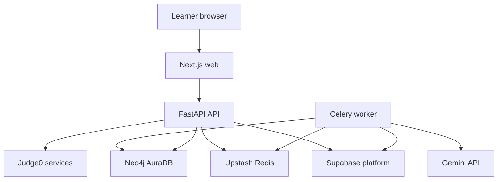
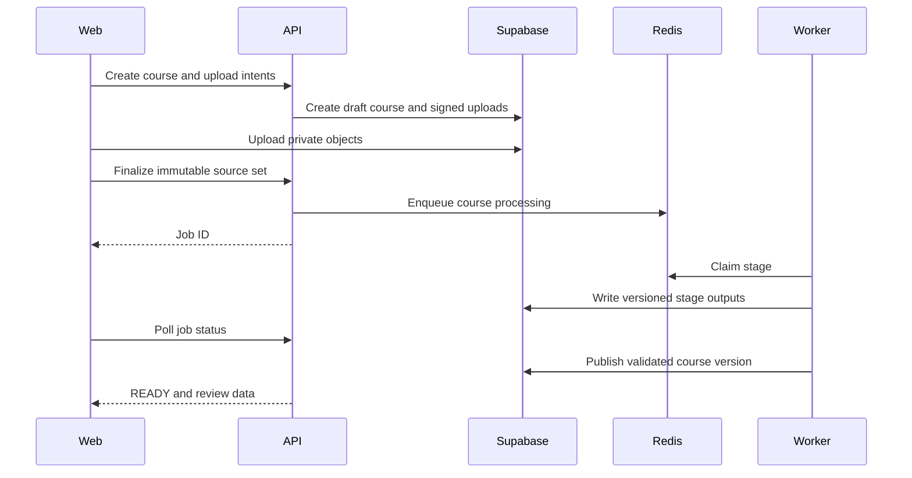
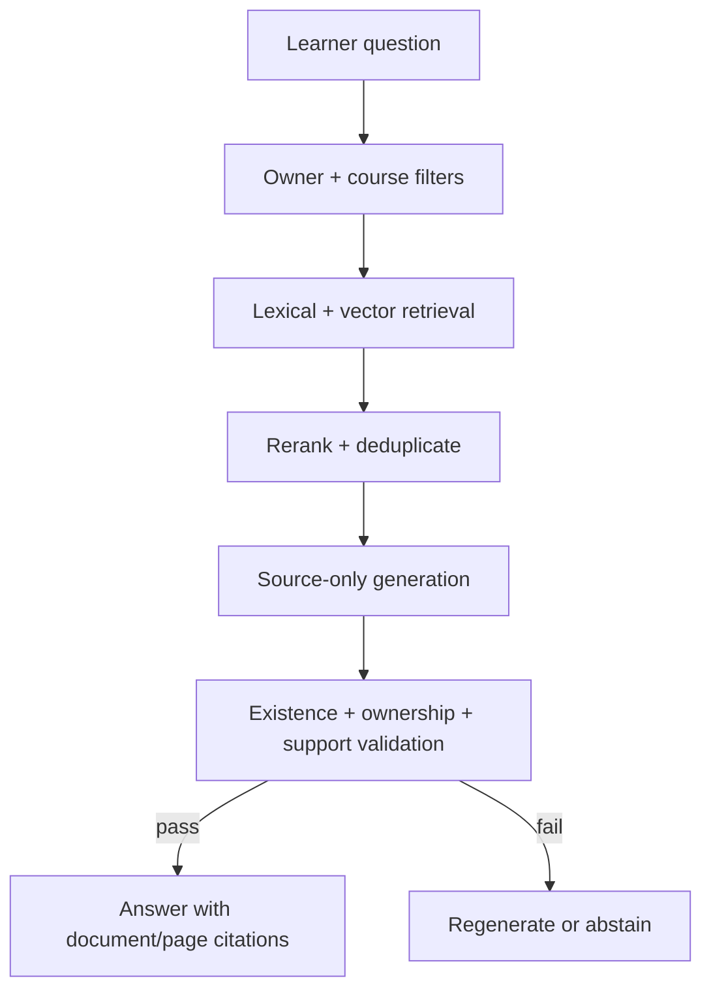
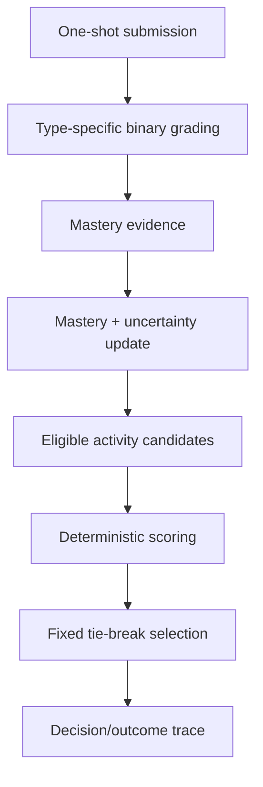

# NeuroLearn — Architecture

Status: frozen architecture for the one-week prototype.

Read `frozen-scope.md` for product behavior and limitations. This document owns service boundaries, data ownership, deployment topology, processing flows, and technology justification.

## Architectural drivers

1. Execute a real upload-to-adaptation loop on unseen material.
2. Keep generated claims confined to course-owned sources.
3. Make long-running document work resumable and observable.
4. Keep recommendation selection deterministic and testable.
5. Preserve enough version and outcome history for evaluation.
6. Isolate untrusted Python execution from product data and secrets.
7. Remain viable for a three-person, one-week prototype with near-zero operating cost.

## System context



## Deployment topology

| Component | Deployment | Responsibility |
|---|---|---|
| Next.js web | Vercel Hobby | Learner and evaluator UI |
| FastAPI API | Railway Hobby | REST API, authorization, orchestration, polling |
| Celery worker | Railway Hobby | Durable document, generation, validation, projection jobs |
| Application Redis | Upstash Free | Celery broker/result coordination |
| PostgreSQL/pgvector | Supabase Free | Product source of truth, chunks, vectors, histories |
| Auth | Supabase Auth | Google OIDC identity and sessions |
| Object storage | Supabase Storage | Private originals and derived page/asset objects |
| Prerequisite graph | Neo4j AuraDB Free | Disposable graph projection and traversal |
| Judge0 server/workers | Railway services | Networkless Python submission execution |
| Judge0 backing data | Dedicated Railway PostgreSQL and Redis services | Judge0-internal queue and state; never product data |
| Generation/vision/embeddings | Gemini API free tier | `gemini-2.5-flash-lite` generation/multimodal/validation and `gemini-embedding-001` embeddings |

Railway is budgeted at the Hobby minimum rather than assumed to remain within the $1 monthly free-resource allowance.

### Judge0 deployment risk

Judge0's standard deployment expects several Docker Compose services. The frozen plan decomposes its official images into Railway services with dedicated backing stores. This is the highest-risk infrastructure assumption and receives a day-one spike. Failure of that spike blocks Python assessment but must not destabilize the API, worker, or application Redis.

## Module boundaries

### Web application

- Authentication callback and session bootstrap.
- Setup/upload, processing status, course review, graph editing, diagnostic, learning workspace, progress, and evaluation screens.
- Typed API client; no direct domain mutations against Supabase.
- Polling for job state; no WebSocket dependency.

### API application

The FastAPI service is a modular monolith:

| Module | Owns |
|---|---|
| Identity | Supabase token verification, user mapping, admin authorization |
| Courses | Course lifecycle, immutable source set, published course version |
| Documents | Upload intents, private object metadata, signed read access |
| Jobs | Job creation, status projection, retry authorization |
| Curriculum | Modules, lessons, concepts, graph edits and versions |
| Learning | Current activity, interruption state, course completion |
| Assessments | Blueprints, question delivery, submissions, feedback |
| Mastery | Evidence application, mastery and uncertainty state/history |
| Recommendations | Candidate construction, deterministic scoring, tie-breaking |
| Tutor | Course-scoped retrieval request and grounded response contract |
| Evaluation | Admin-only metrics, traces, simulated profiles and pilot records |
| Quotas | Per-user resource and model-call limits |

Modules communicate through explicit service interfaces and domain identifiers. Routes do not write database tables directly.

### Worker application

Celery tasks call the same domain services through worker-safe application interfaces. Tasks are idempotent and keyed by job, stage, course version, document version, and generated-artifact version.

Worker pipelines:

- Document extraction and visual interpretation.
- Structure-aware chunking and embedding.
- Syllabus, concept, hierarchy, and prerequisite generation.
- Graph structural validation and Neo4j projection.
- Lesson and assessment generation.
- Separate question and citation validation.
- Generated test-pair equivalence validation.
- Evaluation aggregation.

### Recommendation engine

This is a pure domain module with one high-level seam:

```text
recommend(learner_state, course_state, activity_history)
→ selected_activity + candidate_scores + reason_features
```

It has no network, database, or model dependency. Persistence and presentation wrap this seam.

### Mastery engine

This is also pure:

```text
apply_evidence(previous_state, binary_correctness, estimated_difficulty)
→ mastery_state + uncertainty_state + evidence_record
```

Unknown state, independent-evidence rules, completion thresholds, and history creation are tested through this interface.

### Retrieval/generation gateway

All AI operations pass through typed gateways:

- `EmbeddingGateway`
- `GenerationGateway`
- `MultimodalGateway`
- `ValidationGateway`

P0 adapters use `gemini-2.5-flash-lite` and `gemini-embedding-001`. Every request records purpose, model, prompt/schema version, latency, token usage, outcome, and artifact version without logging source content.

## Primary flows

### Upload and course publication



### Grounded tutor response



### Assessment to next activity



## Data ownership and schema

PostgreSQL is the only durable product source of truth. Neo4j can be rebuilt from a published graph version. Redis contains coordination state, not authoritative product state.

### Identity and access

- `users`: Supabase user ID, email, profile, role, created time.
- `pilot_participants`: pseudonymous participant ID, consent state, enrollment state.

### Courses and sources

- `courses`: owner, title, goal, confidence, status, published version.
- `course_priorities`: prioritized or excluded module/topic labels.
- `documents`: course, storage object, format, role, size, page count, immutable version.
- `document_pages`: page number, extraction status, text, OCR/visual confidence.
- `source_assets`: page, type, bounding metadata, private object, interpretation.
- `processing_jobs`: owner, course, overall status, retry count, current stage.
- `processing_stages`: job, stage, status, attempts, timestamps, safe error category.

### Retrieval

- `chunks`: course, document, page range, heading path, content type, text, provenance.
- `chunk_embeddings`: chunk, embedding model, vector dimension, vector.
- `retrieval_traces`: query purpose, selected chunk IDs, scores, reranker version, latency.

### Curriculum and graph

- `course_versions`: draft/published state, schema version, source-set fingerprint.
- `modules`: version, order, title, syllabus provenance.
- `lessons`: module, order, title, objectives.
- `concepts`: lesson, title, description, confidence, source provenance.
- `prerequisite_edges`: graph version, prerequisite concept, dependent concept, confidence, provenance.
- `graph_versions`: course version, projection status, validation result.
- `content_gaps`: syllabus topic, reason, resolution state.

### Generated content and assessments

- `generated_artifacts`: course/concept, purpose, prompt/schema/model version, content, validation status.
- `citations`: artifact/claim, chunk, document, page, support status.
- `assessment_blueprints`: course/concept coverage, type and difficulty plan.
- `questions`: blueprint, concept, type, prompt, expected answer/tests, difficulty, artifact version.
- `question_validations`: support, answerability, duplication, equivalence, validator metadata.
- `attempts`: learner, question, submitted value/code, binary result, response duration.

### Adaptation

- `mastery_states`: learner, concept, optional mastery, uncertainty, evidence count.
- `mastery_events`: attempt, prior/current state, active evidence factors.
- `presentation_affinities`: learner, format, affinity, uncertainty, observation count.
- `activity_instances`: learner, activity type, concept, state, artifact version.
- `adaptation_decisions`: candidate scores, selected activity, reason features, rule version.
- `adaptation_outcomes`: decision, subsequent attempt, mastery change.

### Evaluation

- `pilot_sessions`: participant, session type, timestamps.
- `pre_post_pairs`: participant, concepts, equivalence-validation result, score delta.
- `simulated_profiles`: fixture state and expected decision.
- `evaluation_runs`: metric definitions, thresholds, inputs, results, version.
- `security_events`: anonymized category, component, blocked/allowed result.

### JSONB policy

Core identity, ownership, lifecycle, relationships, and score fields are relational. Variable AI payloads, candidate arrays, validation details, provider metadata, and evaluation evidence use JSONB with an explicit schema version.

## Cross-store consistency

1. Commit the authoritative graph version and edges in PostgreSQL.
2. Enqueue a projection task keyed by graph version.
3. Upsert Neo4j nodes and edges with course, owner, and graph-version identifiers.
4. Mark projection success in PostgreSQL.
5. Serve graph traversal only for the current successfully projected version.
6. Rebuild Neo4j from PostgreSQL when versions diverge.

No distributed transaction is required.

## API surface

### Identity and courses

- `GET /me`
- `POST /courses`
- `GET /courses`
- `GET /courses/{courseId}`
- `DELETE /courses/{courseId}`
- `POST /courses/{courseId}/uploads`
- `POST /courses/{courseId}/finalize-sources`

### Processing and structure

- `GET /jobs/{jobId}`
- `POST /jobs/{jobId}/retry`
- `GET /courses/{courseId}/structure`
- `PUT /courses/{courseId}/structure`
- `GET /courses/{courseId}/graph`
- `PUT /courses/{courseId}/graph`
- `POST /courses/{courseId}/publish-structure`

### Learning

- `POST /courses/{courseId}/diagnostic/start`
- `POST /attempts`
- `GET /courses/{courseId}/next-activity`
- `GET /activities/{activityId}`
- `POST /activities/{activityId}/rating`
- `POST /courses/{courseId}/tutor`
- `GET /courses/{courseId}/progress`

### Evaluation

- `GET /admin/evaluation/summary`
- `GET /admin/evaluation/runs/{runId}`
- `POST /admin/evaluation/simulations/run`

Exact payloads live in the shared OpenAPI-generated contracts; the API specification is authoritative.

## Security and trust boundaries

- The browser never receives service credentials.
- Supabase objects remain private; API-authorized short-lived signed URLs permit access.
- The worker alone receives direct processing access to source objects.
- Every API service and retrieval query verifies user and course ownership.
- Retrieved source text is untrusted model data and has no tool capability.
- Judge0 receives only code, harness, language, and limits; it receives no product JWT, database URL, object URL, or AI key.
- Judge0 has no outbound network access.
- Logs exclude document content, learner answers, tokens, and signed URLs.
- P0 accepts the consciously limited extension-only upload validation and lack of malware scanning documented in scope.

## Failure model

| Failure | Required behavior |
|---|---|
| Invalid extension or documented size/page limit | Reject before enqueue |
| Extraction or generation stage fails | Preserve prior stages; mark failed; allow manual retry |
| Gemini quota/unavailable | Pause job; expose retryable provider error |
| Citation support fails | Bounded regeneration, then abstention |
| Graph contains a cycle | Block course readiness until learner edit/regeneration |
| Neo4j projection fails | Keep PostgreSQL version authoritative; retry projection |
| Judge0 unavailable | Mark Python assessment unavailable; leave mastery uncertain |
| Redis task redelivery | Idempotent stage reuses or safely replaces its draft output |
| Browser disconnects | Job continues; polling resumes on return |
| Account deletion | Cascade product data and issue object/graph deletion jobs |

## Test seams

Prefer the highest observable seam:

1. End-to-end golden path against two unseen document sets.
2. API integration tests through HTTP with real PostgreSQL/pgvector, Redis, and Neo4j containers.
3. Processing pipeline contract tests using fixed source fixtures and stubbed Gemini responses.
4. Retrieval tests through the course-scoped retrieval interface.
5. Pure mastery and recommendation engine tests without infrastructure.
6. Judge0 adapter contract tests against the deployed/local service.
7. Browser tests for sign-in boundary, polling, review, diagnostic, learning, and progress.

Tests assert external behavior and durable state, not internal method calls.

## Technology justification

| Technology | Requirement served | Why selected |
|---|---|---|
| Next.js/TypeScript | Polished multi-surface web app | Fast component development, typed UI, strong deployment path |
| Tailwind + shadcn/ui | Presentable one-week UI | Reusable accessible primitives without custom design-system overhead |
| React Flow | Editable prerequisite graph | Purpose-built node/edge interaction |
| FastAPI/Pydantic | Typed API and AI schemas | Python ecosystem plus strict request/model-output validation |
| SQLAlchemy/Alembic | Relational persistence and migrations | Explicit schema ownership and repeatable database connectivity |
| Docling/RapidOCR | Multi-format extraction and local OCR | Unified representation across required formats and reduced model calls |
| Supabase | Auth, PostgreSQL, pgvector, storage | Consolidates four managed services with a prototype free tier |
| Upstash Redis/Celery | Durable background work | Explicit retryable worker model and low-cost managed broker |
| Neo4j AuraDB | Graph traversal and visualization backing | Dedicated graph capability requested for prerequisite relationships |
| Gemini Flash-Lite | Lowest-cost multimodal generation | One stable, reproducible provider/model path for P0 |
| Gemini embeddings | Semantic retrieval | Same-provider embedding workflow stored in pgvector |
| Judge0 | Untrusted Python execution | Open-source sandboxed online judge with HTTP contract |
| Railway | API, worker and Judge0 deployment | Multi-service Docker deployment with a low-cost Hobby plan |
| Vercel | Next.js hosting | Direct framework deployment for a non-commercial academic project |
| Docker Compose | Local parity | Reproducible PostgreSQL/pgvector, Redis, Neo4j and Judge0 dependencies |

## Architecture acceptance criteria

- Database migrations create every P0 table and connectivity checks pass.
- Each service boundary in the context diagram has a working health/contract check.
- Ownership isolation prevents cross-user course, object, chunk, graph, and evaluation access.
- Job retry does not duplicate chunks, concepts, questions, or published versions.
- Neo4j can be deleted and rebuilt from PostgreSQL.
- Gemini output is rejected when it fails the required schema.
- Judge0 cannot access the public network or product secrets.
- The two unseen document sets complete the frozen golden path.

## External reference baseline

Provider limits and model availability are time-sensitive. These official references were checked on 27 August 2026 and must be rechecked before deployment and the final presentation:

- [Supabase pricing](https://supabase.com/pricing) and [pgvector documentation](https://supabase.com/docs/guides/database/extensions/pgvector)
- [Upstash Redis pricing](https://upstash.com/pricing/redis)
- [Neo4j AuraDB pricing](https://neo4j.com/pricing/)
- [Gemini API pricing](https://ai.google.dev/gemini-api/docs/pricing), [models](https://ai.google.dev/gemini-api/docs/models), and [embeddings](https://ai.google.dev/gemini-api/docs/embeddings)
- [Docling supported formats](https://docling-project.github.io/docling/usage/supported_formats/) and [OCR engines](https://docling-project.github.io/docling/concepts/OCR/)
- [Railway plans](https://docs.railway.com/pricing/plans)
- [Vercel Hobby plan](https://vercel.com/docs/plans/hobby)
- [Judge0 repository and deployment documentation](https://github.com/judge0/judge0)
